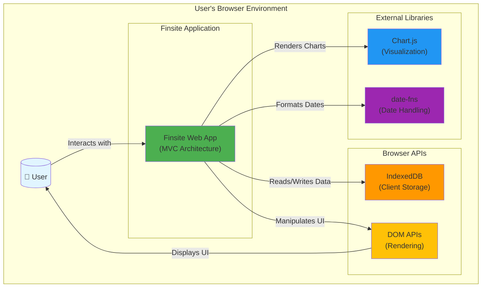

# System Context Diagram

## Overview
This diagram shows Finsite's position within its environment, including external systems, user interactions, and data boundaries.

## Diagram

## Description

**Finsite** is a fully client-side personal finance application that runs entirely in the user's browser with no backend server.

### Key Boundaries

**User Interactions:**
- User interacts with the application through the web UI
- All interactions are immediate (no network requests)
- Data never leaves the user's browser

**Data Storage:**
- All financial data stored locally in IndexedDB
- No cloud sync or external database connections
- Privacy-focused: user owns their data completely

**External Dependencies:**
- **Chart.js**: For rendering financial charts and graphs
- **date-fns**: For date parsing and formatting
- **DOM APIs**: For UI rendering and manipulation

### Security & Privacy

- **No Server**: Application has no backend; all logic runs client-side
- **No Network Calls**: After initial page load, no data transmitted
- **Local Storage Only**: IndexedDB keeps all data in browser
- **User Control**: User can export, clear, or backup data at any time

## Related ADRs

- [ADR-01: Use MVC Architecture](../adr/01-use-mvc-architecture.md)
- [ADR-02: Choose IndexedDB for Storage](../adr/02-choose-indexeddb-for-storage.md)
- [ADR-03: Adopt Chart.js for Visualization](../adr/03-adopt-chartjs-for-visualization.md)
- [ADR-05: Use Vanilla JavaScript](../adr/05-use-vanilla-javascript.md)
