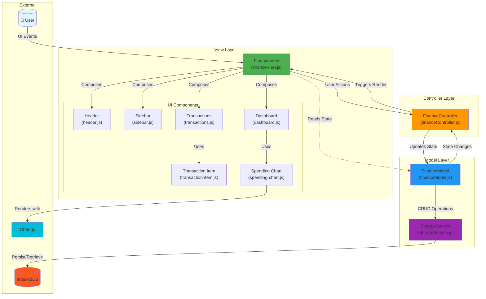

# MVC Architecture Diagram

## Overview
This diagram illustrates Finsite's implementation of the Model-View-Controller pattern, showing the separation of concerns and communication flow.

## Diagram

## Description

### Layer Responsibilities

**View Layer (`src/view/`)**
- **Purpose**: Render UI and handle DOM manipulation
- **Responsibilities**:
  - Compose UI components into cohesive interface
  - Bind event listeners to user interactions
  - Display data from Model
  - Call Controller methods when user takes actions
- **Key Rule**: Never modifies Model directly; always goes through Controller

**Controller Layer (`src/controller/`)**
- **Purpose**: Orchestrate application logic and coordinate between View and Model
- **Responsibilities**:
  - Handle user actions from View
  - Validate user input
  - Update Model state
  - Trigger View re-renders
  - Implement business logic (calculations, filtering, sorting)
- **Key Rule**: Doesn't directly manipulate DOM; delegates to View

**Model Layer (`src/model/`)**
- **Purpose**: Manage application state and data persistence with high-performance aggregation
- **Responsibilities**:
  - Store application state (transactions, categories, groups)
  - Provide data access methods
  - Maintain incremental aggregates for dashboard metrics (O(1) updates)
  - Interact with StorageService for persistence
  - Notify Controller of state changes
- **Key Features**:
  - **Incremental Aggregation**: Maintains running totals by time bucket and group
  - **Cached Metrics**: Pre-computed monthly/weekly stats avoid full data scans
  - **Time Bucketing**: Organizes transactions by month for efficient querying
- **Key Rule**: No UI knowledge; purely data-focused

### Communication Flow

**User Action Flow:**
1. User interacts with UI (clicks button, submits form)
2. View captures event and calls Controller method
3. Controller validates input and updates Model
4. Model persists changes via StorageService to IndexedDB
5. Controller triggers View re-render
6. View reads updated state from Model and updates DOM

**Data Read Flow:**
- View always reads current state directly from Model
- Model provides synchronous getters for UI rendering
- Controller doesn't sit between View and Model for reads

### Component Organization

**UI Components** (`src/components/`)
- Modular, reusable UI pieces
- Encapsulate DOM structure and styling
- Export creation and update functions
- Used by View layer to compose interface

## Related ADRs

- [ADR-01: Use MVC Architecture](../adr/01-use-mvc-architecture.md)
- [ADR-04: Organize UI with Modular Components](../adr/04-organize-ui-with-modular-components.md)
- [ADR-05: Use Vanilla JavaScript](../adr/05-use-vanilla-javascript.md)
