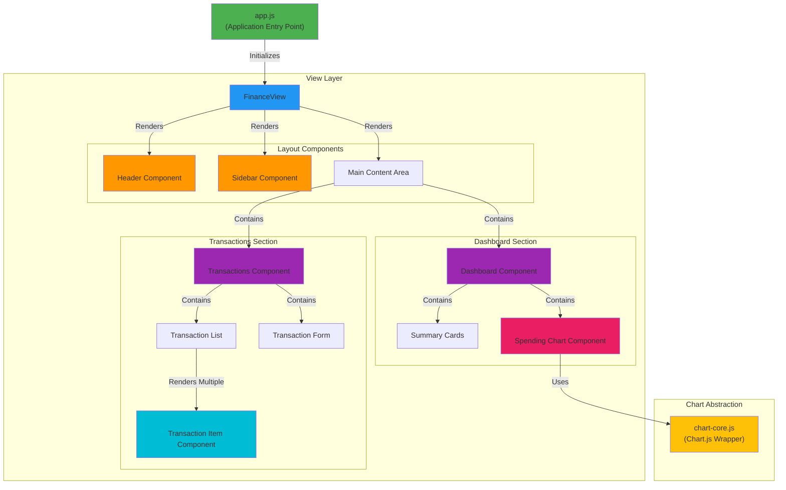

# Component Hierarchy Diagram

## Overview
This diagram shows the hierarchical structure of UI components and their composition relationships. Finsite uses Web Components (Custom Elements) for UI modularity.

## Diagram

## Description

### Component Hierarchy

**Application Root (`app.js`)**
- Entry point that initializes the entire application
- Sets up Controller, Model, and View
- Handles initial data load

**View Layer (`financeView.js`)**
- Top-level component that orchestrates all UI
- Manages layout and component composition
- Coordinates component updates

### Layout Components

**Header Component (`header.js` → `<finsite-header>`)**
- **Purpose**: App branding and navigation
- **Implementation**: Web Component with Shadow DOM
- **Contains**: Logo, title, navigation links
- **Responsibilities**: Navigation state, user menu

**Sidebar Component (`sidebar.js` → `<finsite-sidebar>`)**
- **Purpose**: Navigation and filters
- **Implementation**: Web Component with Shadow DOM
- **Contains**: Navigation links, date range filters, category filters, view toggles
- **Responsibilities**: Route navigation, filter state management, event handling

**Main Content Area**
- **Purpose**: Container for primary content sections
- **Contains**: Dashboard or Transactions section (dynamic based on route)

### Content Sections

**Dashboard Section**
- **Dashboard Component** (`dashboard.js` → `<finsite-dashboard>`)
  - Web Component with Shadow DOM
  - Orchestrates summary view with pre-aggregated data from Model
  - Coordinates cards and charts
  - Receives `panelData` and `chartData` props
  
- **Summary Cards**
  - Rendered within dashboard shadow DOM
  - Display key metrics (total spent, monthly spending, weekly transactions)
  - Use incremental aggregates from Model
  
- **Spending Chart Component** (`spending-chart.js` → `<finsite-spending-chart>`)
  - Web Component with Shadow DOM
  - Visualizes spending trends over time
  - Uses Chart.js wrapper for rendering
  - Handles chart interactions
  - Receives pre-aggregated chart data

**Transactions Section**
- **Transactions Component** (`transactions.js` → `<finsite-transactions>`)
  - Web Component with Shadow DOM
  - Main container for transaction management
  - Coordinates list and form
  
- **Transaction List**
  - Rendered within transactions shadow DOM
  - Scrollable list of transactions
  - Handles sorting and filtering display
  
- **Transaction Item Component** (`transaction-item.js` → `<finsite-transaction-item>`)
  - Web Component (can be used with or without Shadow DOM)
  - Represents single transaction
  - Reusable across different contexts
  - Handles edit/delete actions
  
- **Transaction Form**
  - Rendered within transactions shadow DOM
  - Add/edit transaction interface
  - Form validation and submission
  - Group and category selection

### Chart Abstraction

**chart-core.js**
- Wraps Chart.js library
- Provides consistent configuration
- Handles theme and styling
- Simplifies chart creation across components

### Component Communication

**Parent → Child**: Props/Data passed down
- View passes data and callbacks to Web Components via attributes and properties
- Components receive configuration and event handlers
- Web Components use Shadow DOM for encapsulation

**Child → Parent**: Events bubbled up
- Components emit custom events (using `CustomEvent`)
- Controller methods handle events
- State updates flow back down as new props

**Web Component Pattern:**
- Each component extends `HTMLElement`
- Uses Shadow DOM for style encapsulation
- Registers with `customElements.define()`
- Communicates via attributes, properties, and events

### Reusability

**Highly Reusable:**
- `<finsite-transaction-item>` - Used in lists, search results, reports
- `<finsite-spending-chart>` - Can be reused for different data visualizations
- `chart-core.js` - Used across all chart visualizations

**Context-Specific:**
- `<finsite-dashboard>` - Dashboard-specific layout
- `<finsite-transactions>` - Transaction management specific
- `<finsite-sidebar>` - App navigation specific

## Related ADRs

- [ADR-04: Organize UI with Modular Components](../adr/04-organize-ui-with-modular-components.md)
- [ADR-03: Adopt Chart.js for Visualization](../adr/03-adopt-chartjs-for-visualization.md)
