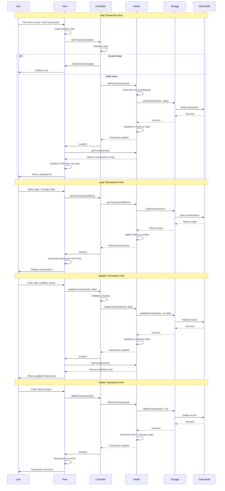

# Data Flow Diagram

## Overview
This diagram shows how data flows through the application from user actions to storage and back to the UI.

## Diagram



## Description

### Data Flow Patterns

**1. User Input → Storage (Write Path)**
```
User Action → View (capture) → Controller (validate) → Model (process) → Storage (persist) → IndexedDB
```

**2. Storage → User Display (Read Path)**
```
IndexedDB → Storage (retrieve) → Model (filter/sort) → View (render) → User Display
```

### Key Data Operations

**Create (Add Transaction)**
1. User fills transaction form (amount, description, date, category, group)
2. View captures and sends to Controller
3. Controller validates (amount > 0, required fields, date format)
4. Model generates auto-incremented numeric ID
5. Model updates incremental aggregates (time buckets, group totals)
6. Storage persists to IndexedDB
7. Model updates in-memory cache
8. View re-renders with new transaction

**Read (Load Transactions)**
1. User opens app or changes filter
2. Controller requests transactions
3. Model retrieves from Storage (all transactions loaded at once)
4. Model applies filters in memory (date range, category, group, search)
5. Model applies sorting (date, amount, category)
6. Model uses cached aggregates for dashboard metrics (no recalculation)
7. View receives sorted/filtered array and pre-computed metrics
8. View renders transaction list and dashboard

**Update (Edit Transaction)**
Currently implemented as delete + add:
1. User clicks edit on transaction
2. View shows form pre-filled with data
3. User modifies and saves
4. Controller validates changes
5. Model deletes old transaction (updates aggregates)
6. Model adds new transaction with changes (updates aggregates)
7. IndexedDB handles both operations
8. View re-renders updated transaction

**Delete (Remove Transaction)**
1. User clicks delete (with confirmation)
2. Controller requests deletion with numeric ID(s)
3. Model removes from incremental aggregates (O(1) operation)
4. Model removes via Storage (can batch delete multiple IDs)
5. IndexedDB deletes record(s)
6. Model removes from in-memory cache
7. View removes from DOM (no full re-render needed)

### Data Transformations

**Input Validation (Controller)**
- Ensure required fields present (amount, date, category, group)
- Validate data types (number for amount, date for date)
- Check business rules (amount > 0, valid date)
- Sanitize strings to prevent XSS

**Data Enrichment (Model)**
- Generate auto-incremented numeric IDs (via IndexedDB)
- Update incremental aggregates (time buckets, group totals)
- Maintain cached metrics (monthly spending, weekly transactions)
- Normalize data (trim strings, validate category/group references)

**Filtering & Sorting (Model)**
- Apply date range filters (in-memory)
- Filter by category and/or group
- Search by description (case-insensitive)
- Sort by date, amount, or category
- Use cached aggregates for dashboard (no recalculation)

**Formatting (View)**
- Format currency ($1,234.56)
- Format dates (MMM DD, YYYY)
- Color-code by category/group
- Truncate long descriptions

### Performance Optimizations

**Incremental Aggregation (Model)**
- Maintains running totals by time bucket (month) and group
- O(1) updates on add/delete operations (no full data scan)
- Pre-computed metrics for dashboard (this month, last month, 6-month total)
- Cached aggregates invalidated only when transactions change

**In-Memory Caching**
- Model keeps transactions in memory after first load
- Filtering/sorting done in memory (very fast)
- Aggregates maintained alongside transaction data
- Cache invalidated on Create/Delete operations

**Incremental Updates**
- Delete operations only remove DOM element, no full re-render
- Edit operations handled as delete + add with aggregate updates
- Add operations append to list rather than rebuild
- Dashboard uses pre-computed metrics, never scans all transactions

**Batch Operations**
- Multiple transaction deletions handled as single IndexedDB transaction
- Aggregate updates batched during multi-delete

### Error Handling

**Validation Errors**
- Caught at Controller before reaching Model
- User-friendly messages displayed by View
- Form state preserved for correction

**Storage Errors**
- IndexedDB failures caught by Storage layer
- Model maintains previous state
- User notified with retry option

**State Recovery**
- On error, revert to last known good state
- Transaction rollback for multi-step operations

## Related ADRs

- [ADR-01: Use MVC Architecture](../adr/01-use-mvc-architecture.md)
- [ADR-02: Choose IndexedDB for Storage](../adr/02-choose-indexeddb-for-storage.md)
