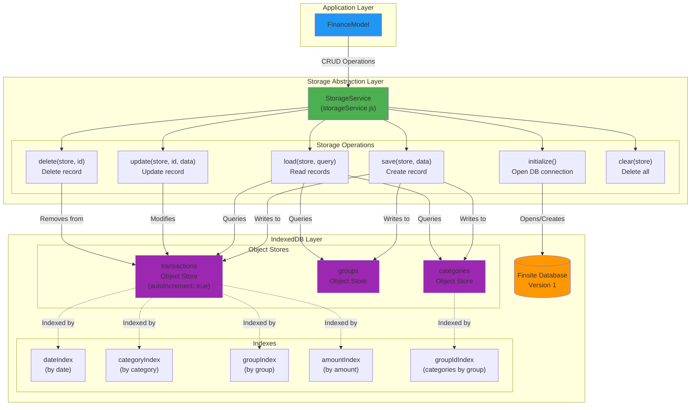

# Storage Architecture Diagram

## Overview
This diagram details the storage layer architecture, including IndexedDB structure, the StorageService abstraction, and data persistence patterns.

## Diagram



## Database Schema

### Database: `finsiteDB`
**Version:** 2

### Object Stores

**1. transactions**
```javascript
{
  keyPath: 'id',
  autoIncrement: true,      // Auto-incrementing numeric IDs
  indexes: {
    'groupIndex': { keyPath: 'group', unique: false },
    'categoryIndex': { keyPath: 'category', unique: false },
    'amountIndex': { keyPath: 'amount', unique: false },
    'dateIndex': { keyPath: 'date', unique: false }
  }
}
```

**Record Structure:**
```javascript
{
  id: 123,                    // Auto-incremented numeric ID
  amount: 123.45,            // Transaction amount
  category: "groceries",     // Category ID
  group: "household",        // Group ID
  description: "Whole Foods", // User description
  date: "2025-12-08"         // ISO date string (YYYY-MM-DD)
}
```

**2. groups**
```javascript
{
  keyPath: 'id',
  autoIncrement: false
}
```

**Record Structure:**
```javascript
{
  id: "household",           // Unique string identifier
  name: "Household",         // Display name
  color: "#4CAF50",         // Hex color for UI (optional)
  icon: "🏠"                // Emoji or icon identifier (optional)
}
```

**3. categories**
```javascript
{
  keyPath: 'id',
  autoIncrement: false,
  indexes: {
    'groupIdIndex': { keyPath: 'groupId', unique: false }
  }
}
```

**Record Structure:**
```javascript
{
  id: "groceries",           // Unique string identifier
  name: "Groceries",         // Display name
  groupId: "household",      // Parent group ID
  color: "#4CAF50",         // Hex color for UI (optional)
  icon: "🛒"                // Emoji or icon identifier (optional)
}
```

## StorageService API

### Initialization

```javascript
await storageService.initialize()
```
- Opens IndexedDB connection
- Creates object stores if first run
- Runs migrations if version changes

### Create

```javascript
await addTransaction(transactionData)
```
- Inserts new record with auto-incremented numeric ID
- Returns saved transaction object

```javascript
await addGroup(groupData)
```
- Inserts or updates a group (put operation)
- Group ID is string-based

```javascript
await addCategory(categoryData)
```
- Inserts or updates a category (put operation)
- Category ID is string-based, belongs to a group

### Read

```javascript
// Get all transactions
const all = await getAllTransactions()

// Get all groups
const groups = await getAllGroups()

// Get all categories
const categories = await getAllCategories()
```

### Update

Currently not implemented as separate function. Updates handled by:
1. Deleting old transaction
2. Adding new transaction with updated data

For groups and categories, use `addGroup()` or `addCategory()` which uses IndexedDB's `put()` to update existing records.

### Delete

```javascript
await deleteTransactions([id1, id2, ...])
```
- Removes one or more transactions by numeric IDs
- Accepts array of IDs for batch deletion

### Clear

```javascript
await clearAllTransactions()
```
- Removes all transactions from store (use with caution)
- Used for data reset functionality

## Data Access Patterns

### Query All Records
```javascript
// Load all transactions (Model handles filtering/aggregation)
const transactions = await getAllTransactions()

// Load all groups
const groups = await getAllGroups()

// Load all categories for a group
const categories = await getAllCategories()
const householdCats = categories.filter(c => c.groupId === 'household')
```

### Filtering and Aggregation
Currently handled in the Model layer, not at the storage level:
- Model loads all transactions
- Model applies filters (date range, category, group) in memory
- Model uses incremental aggregation for performance (see Model Architecture)

### Batch Operations
```javascript
// Delete multiple transactions at once
await deleteTransactions([1, 2, 3, 4, 5])
```

## Storage Limitations

**Browser Quotas:**
- Chrome/Edge: ~60% of available disk space
- Firefox: Up to 2GB before prompting
- Safari: ~1GB before prompting

**Best Practices:**
- Monitor storage usage via `navigator.storage.estimate()`
- Implement data archival for old transactions
- Provide export/cleanup tools

**Persistence:**
- Data cleared when user clears browser data
- No automatic backup or sync
- User responsible for exports

## Migration Strategy

When schema changes are needed:

1. **Increment Database Version**
   ```javascript
   const DB_VERSION = 2; // Was 1
   ```

2. **Handle `onupgradeneeded` Event**
   ```javascript
   db.onupgradeneeded = (event) => {
     const db = event.target.result;
     if (event.oldVersion < 2) {
       // Add new index
       const store = event.target.transaction.objectStore('transactions');
       store.createIndex('by-month', 'month', { unique: false });
     }
   };
   ```

3. **Test Migration with Sample Data**
   - Verify existing data preserved
   - Test new features with migrated data

## Related ADRs

- [ADR-02: Choose IndexedDB for Storage](../adr/02-choose-indexeddb-for-storage.md)
- [ADR-01: Use MVC Architecture](../adr/01-use-mvc-architecture.md)
