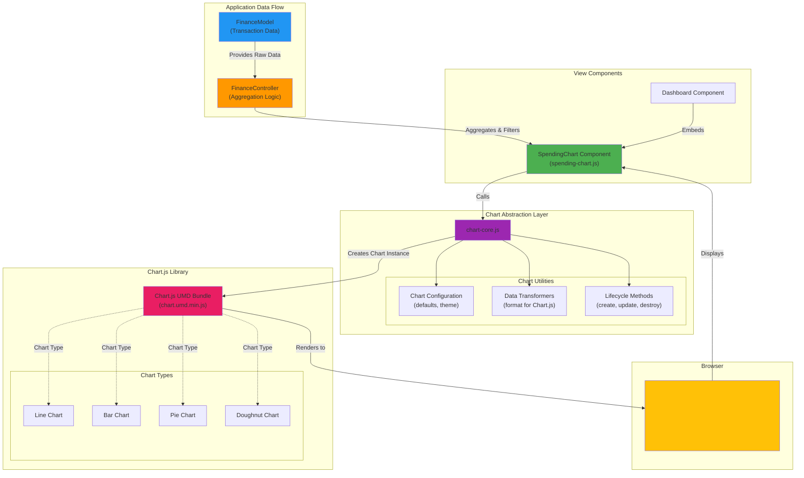

# Chart.js Integration Diagram

## Overview
This diagram shows how Chart.js is integrated into Finsite for data visualization, including the abstraction layer and chart lifecycle.

## Diagram



## Chart Implementation

### Chart Abstraction Layer (`chart-core.js`)

**Purpose:** Wrap Chart.js with consistent defaults, simplified API, and lazy loading

```javascript
// chart-core.js structure
export const ChartCore = {
  // Lazy initialization - Chart.js loaded only when needed
  _chartInstance: null,
  _isInitialized: false,
  
  // Initialize Chart.js (lazy load)
  async initialize() {
    if (this._isInitialized) return;
    // Dynamically import and register Chart.js components
    // Apply global defaults
  },
  // Default theme and styling
  defaultConfig: {
    responsive: true,
    maintainAspectRatio: false,
    plugins: {
      legend: { /* theme */ },
      tooltip: { /* theme */ }
    }
  },
  
  // Create new chart
  createChart(canvasElement, type, data, options) {
    const config = this.mergeConfig(type, data, options);
    return new Chart(canvasElement, config);
  },
  
  // Update existing chart
  updateChart(chartInstance, newData) {
    chartInstance.data = newData;
    chartInstance.update();
  },
  
  // Destroy chart
  destroyChart(chartInstance) {
    chartInstance.destroy();
  },
  
  // Data transformers
  transformForTimeSeries(transactions) { /* ... */ },
  transformForCategoryPie(transactions) { /* ... */ },
  transformForMonthlyBar(transactions) { /* ... */ }
};
```

### Spending Chart Component (`spending-chart.js`)

**Responsibilities:**
- Request aggregated data from Controller
- Transform data for Chart.js format
- Create and manage chart instance
- Handle chart interactions (clicks, hovers)
- Update chart when data changes
- Clean up chart on component destroy

**Lifecycle:**

```javascript
// 1. Create
export function createSpendingChart(containerId, data, options) {
  const canvas = document.createElement('canvas');
  canvas.id = `chart-${containerId}`;
  
  const chartData = ChartCore.transformForTimeSeries(data);
  const chart = ChartCore.createChart(canvas, 'line', chartData, options);
  
  return { element: canvas, chart };
}

// 2. Update
export function updateSpendingChart(chartInstance, newData) {
  const chartData = ChartCore.transformForTimeSeries(newData);
  ChartCore.updateChart(chartInstance, chartData);
}

// 3. Destroy
export function destroySpendingChart(chartInstance) {
  ChartCore.destroyChart(chartInstance);
}
```

## Chart Types Used

### 1. Spending Trend (Line Chart)
**Purpose:** Show spending over time

**Data Format:**
```javascript
{
  labels: ['Jan 1', 'Jan 2', 'Jan 3', ...],  // String labels (not dates)
  datasets: [{
    label: 'Daily Spending',
    data: [45.99, 123.50, 89.00, ...],       // Amounts
    borderColor: '#4CAF50',
    backgroundColor: 'rgba(76, 175, 80, 0.1)',
    tension: 0.4                              // Curve smoothing
  }]
}
```

**Features:**
- String-based x-axis labels (formatted dates from Model)
- Tooltips show formatted label and amount
- Responsive to window resize
- Lazy-loaded Chart.js library

### 2. Category Breakdown (Doughnut Chart)
**Purpose:** Show spending distribution by category

**Data Format:**
```javascript
{
  labels: ['Groceries', 'Dining', 'Transport', ...],
  datasets: [{
    data: [450, 320, 180, ...],              // Category totals
    backgroundColor: ['#4CAF50', '#2196F3', '#FF9800', ...],
    hoverOffset: 4
  }]
}
```

**Features:**
- Color-coded by category
- Percentage in tooltips
- Click to filter transactions
- Animated transitions

### 3. Monthly Comparison (Bar Chart)
**Purpose:** Compare spending across months

**Data Format:**
```javascript
{
  labels: ['Oct', 'Nov', 'Dec'],
  datasets: [
    {
      label: 'Expenses',
      data: [1200, 1450, 1100],
      backgroundColor: '#FF5722'
    },
    {
      label: 'Income',
      data: [2000, 2000, 2000],
      backgroundColor: '#4CAF50'
    }
  ]
}
```

**Features:**
- Grouped bars (income vs expenses)
- Budget line overlay
- Click to drill into month
- Responsive scaling

## Data Transformation Examples

### Transaction Array → Time Series Data

```javascript
// Input: transactions from Model
const transactions = [
  { date: '2025-12-01', amount: 45.99, type: 'expense', ... },
  { date: '2025-12-02', amount: 123.50, type: 'expense', ... },
  // ...
];

// Output: Chart.js format
const chartData = {
  labels: ['2025-12-01', '2025-12-02', ...],
  datasets: [{
    label: 'Daily Spending',
    data: [45.99, 123.50, ...]
  }]
};
```

### Transaction Array → Category Aggregation

```javascript
// Input: transactions
const transactions = [
  { category: 'groceries', amount: 45.99, ... },
  { category: 'groceries', amount: 67.50, ... },
  { category: 'dining', amount: 32.00, ... },
  // ...
];

// Aggregate by category
const byCategory = transactions.reduce((acc, t) => {
  acc[t.category] = (acc[t.category] || 0) + t.amount;
  return acc;
}, {});

// Output: Chart.js format
const chartData = {
  labels: Object.keys(byCategory),           // ['groceries', 'dining', ...]
  datasets: [{
    data: Object.values(byCategory)          // [113.49, 32.00, ...]
  }]
};
```

## Chart Interactions

### Click Events
```javascript
options: {
  onClick: (event, elements) => {
    if (elements.length > 0) {
      const index = elements[0].index;
      const category = chart.data.labels[index];
      // Filter transactions by clicked category
      controller.filterByCategory(category);
    }
  }
}
```

### Hover Events
```javascript
options: {
  onHover: (event, elements) => {
    event.native.target.style.cursor = 
      elements.length > 0 ? 'pointer' : 'default';
  }
}
```

### Tooltips
```javascript
options: {
  plugins: {
    tooltip: {
      callbacks: {
        label: (context) => {
          const value = context.parsed.y;
          return `$${value.toFixed(2)}`;  // Format as currency
        }
      }
    }
  }
}
```

## Performance Considerations

**Large Datasets (>1000 points):**
- Decimate data for line charts (show every nth point)
- Aggregate by day/week/month instead of individual transactions
- Use canvas rendering (already default)
- Disable animations for initial render

**Responsive Updates:**
- Only update chart when data actually changes
- Use `chart.update('none')` to skip animations
- Debounce resize events

**Memory Management:**
- Always destroy chart instances when component unmounts
- Clear references to prevent memory leaks
- Reuse chart instances when possible (update vs recreate)

## Theming

All charts use consistent theme from `chart-core.js`:

```javascript
const theme = {
  colors: {
    primary: '#4CAF50',
    secondary: '#2196F3',
    expense: '#FF5722',
    income: '#4CAF50',
    background: 'rgba(255, 255, 255, 0.8)'
  },
  fonts: {
    family: "'Inter', sans-serif",
    size: 12
  }
};
```

## Related ADRs

- [ADR-03: Adopt Chart.js for Visualization](../adr/03-adopt-chartjs-for-visualization.md)
- [ADR-04: Organize UI with Web Components](../adr/04-organize-ui-with-modular-components.md)

## Implementation Notes

- Chart.js is **lazy-loaded** only when dashboard is rendered (performance optimization)
- **String labels** used for x-axis instead of time scale (no date-fns adapter needed)
- Model provides **pre-aggregated data**—chart doesn't process raw transactions
- chart-core.js registers only needed Chart.js components (smaller bundle)
- Web Component (`<finsite-spending-chart>`) wraps chart functionality with Shadow DOM
